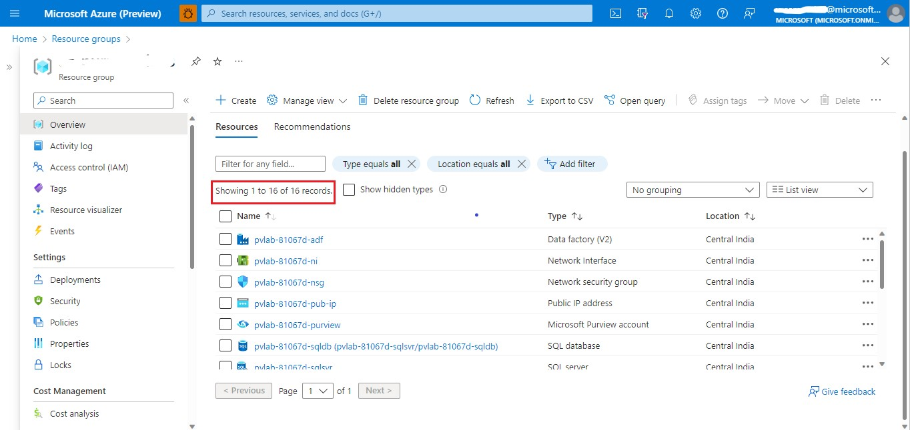
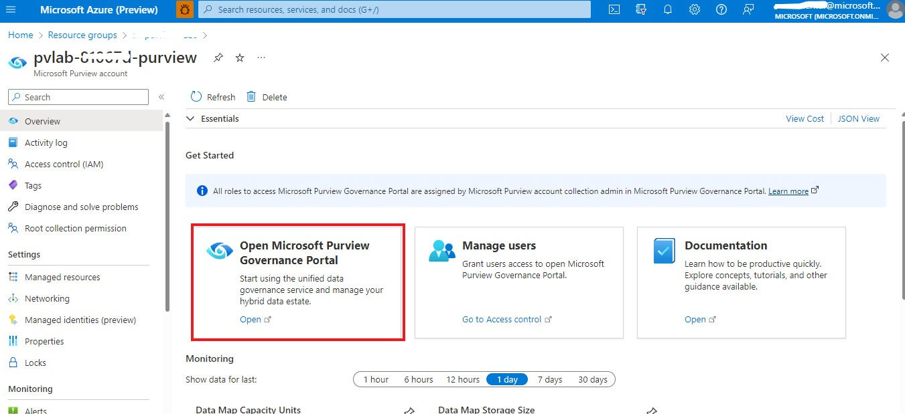
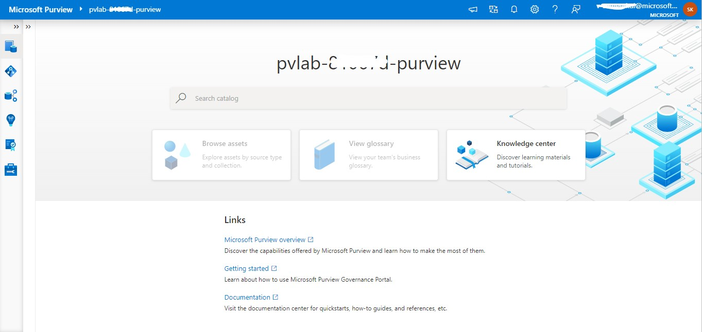
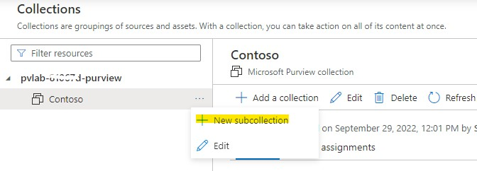
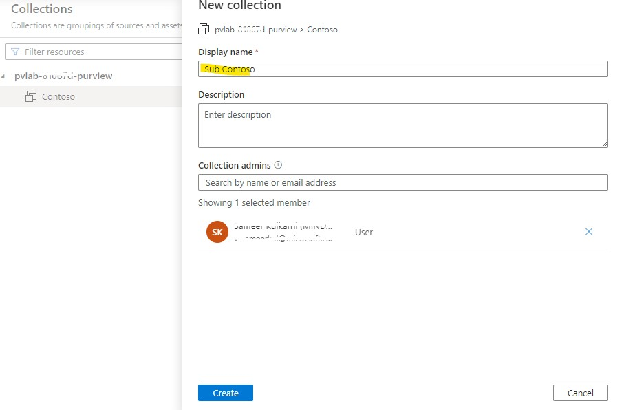
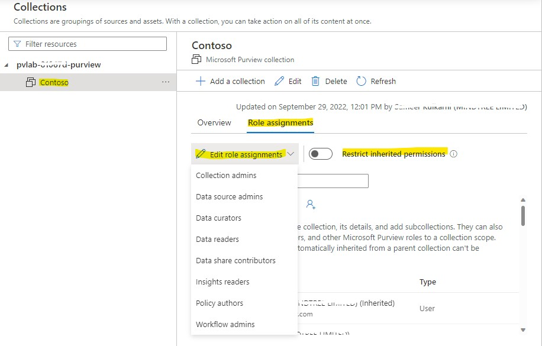
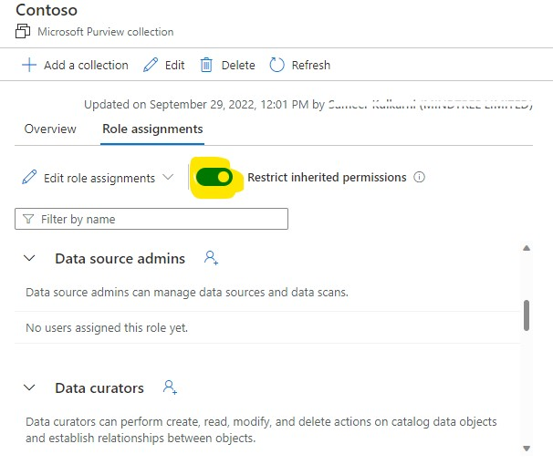
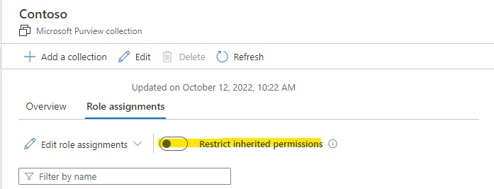
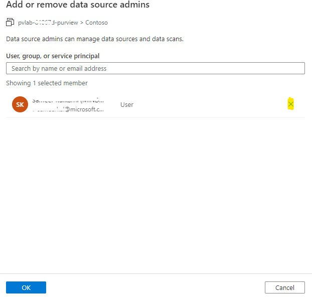

# Creating Collection and Adding Role Assignments

Collections are Microsoft Purview's tool to manage ownership and access control across assets, sources and information.
They also organize your sources and assets into categories that are customized to match your management experience with your data.

### Objectives:

- Creating Collection
- Creating Sub-collection
- Adding Role Assignments
- Restricting Inheritance
- Removing Role Assignments
- Getting started with Purview
- Assigning Roles in Root Collection Role Assignment

### Pre-requisites:

- An *Azure account* with an *active subscription*
- A *Purview resource*
- Users should have *Collection Admin* role for creating Collections
- Users also should have *User Admin Access* in order to set Managed Identity within resources.

### Setting up Purview Workspace:

1. Go to the resource group deployed in the Azure Portal and check the resources.

	- Azure Data Factory
	- Disk
	- Key Vault
	- Microsoft Purview Account
	- Network Interface
	- Network Security Group
	- Public IP Address
	- SQL Database
	- SQL Server
	- SQL Virtual Machine
	- Storage Account
	- Synapse Workspace
	- Virtual Machine
	- Virtual Network

	
	

2. Amongst the list of resources, open the Purview Account that goes with **pvlab-{randomid}-purview**.

3. Scroll down, and click on the **Open Purview Studio Tile**.
				(or)
   Browse to https://web.purview.azure.com, select your Purview account, and sign in to the workspace.
   
   
   
	

4. After landing on to the Purview Workspace. Your Home Page looks like below.

   
   
	

5. After landing on to the Purview Workspace. Go to **Data Map** tab on your left pane.

6. Select **Collections** -> click on your root collection [**pvlab-{randomid}-purview**] -> Role Assignments tab -> Check whether username is added to all the roles.
   If not, click on Add role and give your microsoft account id or name.

   
   	
	

### Creating Collection:

1. Navigate to Data Map tab in your left pane. Go to **Collections** -> Select **Root Collection** (pvlab-{randomid}-purview) -> Add a Collection

   

2. Set your Collection's Display Name as ```Contoso```

   

3. In the Collection Admin, search by your name or email address and select.
   ```E.g: xxx@microsoft.com```

4. Click **Create**

5. User can also edit a collection by clicking **Edit** ✏️ option.

   

6. Description and collection admin can be changed or added.

   

### Creating Sub-collection:

1. Click on the **Contoso** Collection. Add a collection -> New Subcollection

   

2. Give a display name and add collection admin. Click **Create**.

   

> Now that you have collection created. We can add role assignments to the collections and manage the access.

## Role Assignments:

Select Role Assignments tab to see all the roles in a collection.

- **_Collection admins_**: 
  Collection admins can edit the collection, its details, and add subcollections. They can also add data curators, data readers, and other Microsoft Purview roles to a collection scope. Collection admins that are automatically inherited from a parent collection can't be removed.

- **_Data source admins_**:
  Data source admins can manage data sources and data scans.

- **_Data curators_**:
  Data curators can perform create, read, modify, and delete actions on catalog data objects and establish relationships between objects.

- **_Data readers_**:
  Data readers have access to read catalog data objects.

- **_Data share contributors_**:
  Data share contributors can share data within an organization and with other organizations using Data share capabilities. They can view, create, update, and delete sent and received shares.

- **_Insights readers_**:
  A role that provides read-only access to data estate insights reports.

- **_Policy authors_**:
  Policy authors can create, view, update and delete policies through the Policy management app.

- **_Workflow admins_**:
  Workflow admins can perform create, read, modify, and delete action on workflow definitions and the associated workflow runs. Workflow admins can also bind workflow definition with supported business objects.

- **_Restrict inherited permissions_**:
  Collection permissions are inherited automatically from the parent collection. 
  Any permissions on the root collection will be inherited by all collections below it.
  Restricting access will remove inherited permissions from this collection and any subcollections.
  Collection admin permissions won't be affected.

### Adding Role Assignments:

Click on Edit Role Assignments -> Add role -> Give username or email id



### Restricting Inheritance:

Toggle on the **Restrict Inherited Permissions** option. Click **Restrict Access** in the pop-up shown.




You can see that the user has been removed from the inherited roles in data source admins, data curators, data readers, data share contributors, insights readers, policy authors and workflow admins.

> For lab purposes, you make sure that you **turn off** the **Restrict Access** toggle again.





### Removing Role Assignments:

Click on a Role -> Click the ``x`` icon. The user will be removed.

You can remove any role, but don't forget to reassign it because all roles are required in other labs.



[Next Module ⏭️](../02_registering-and-scanning-sql-db-source-and-adls-gen2-account/documentation.md)
