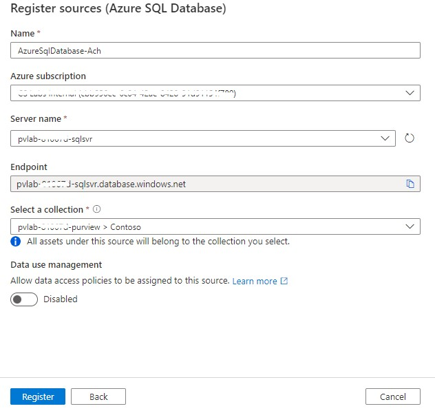
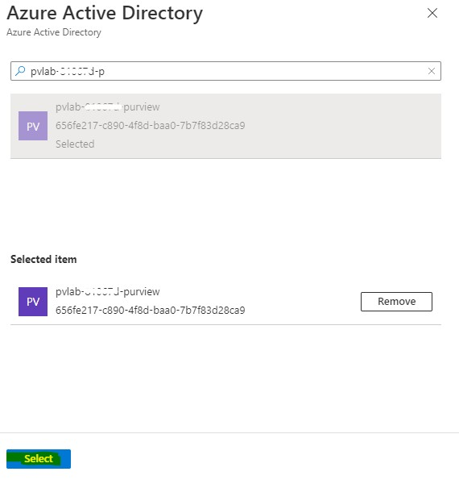
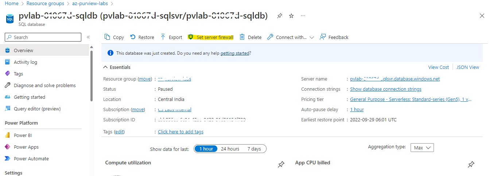
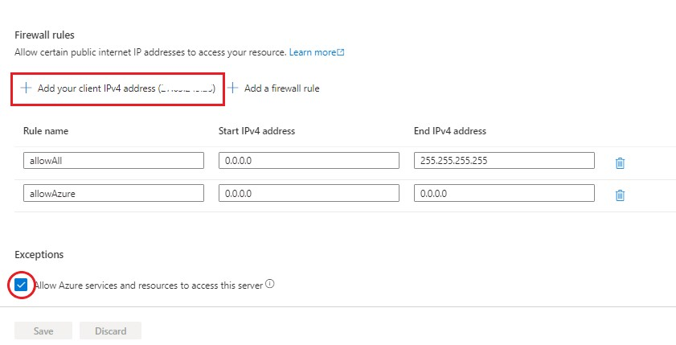
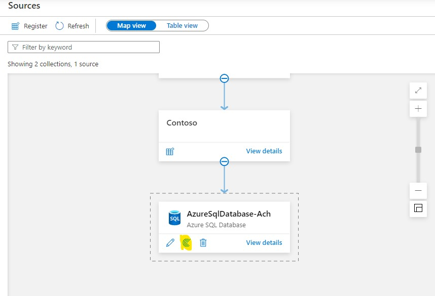
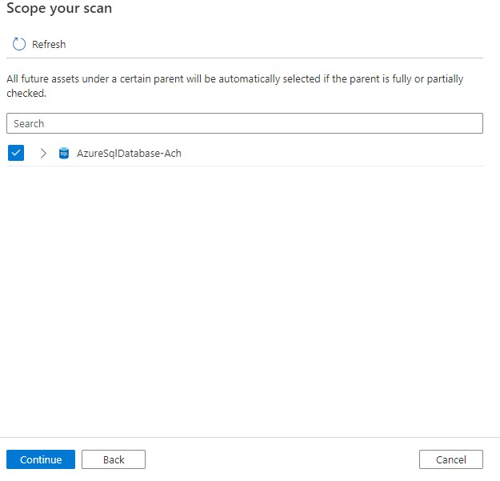
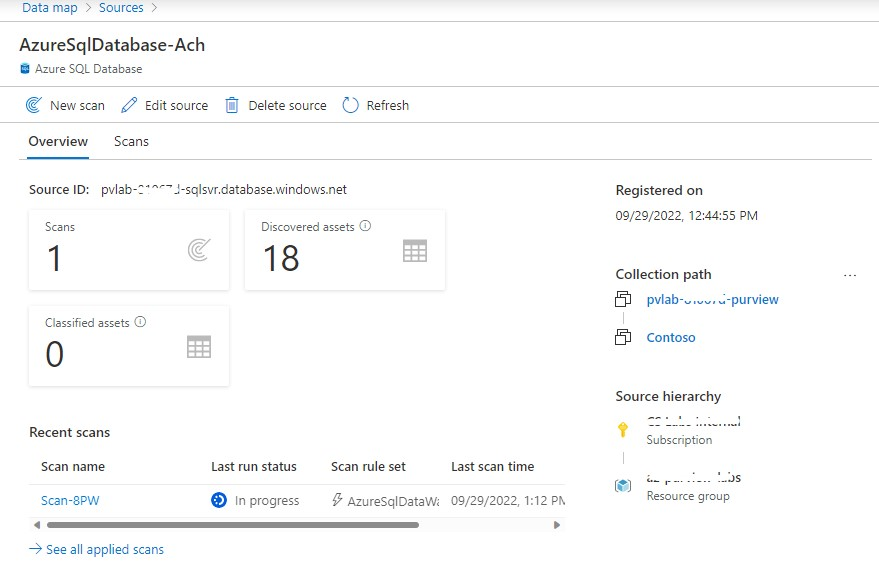
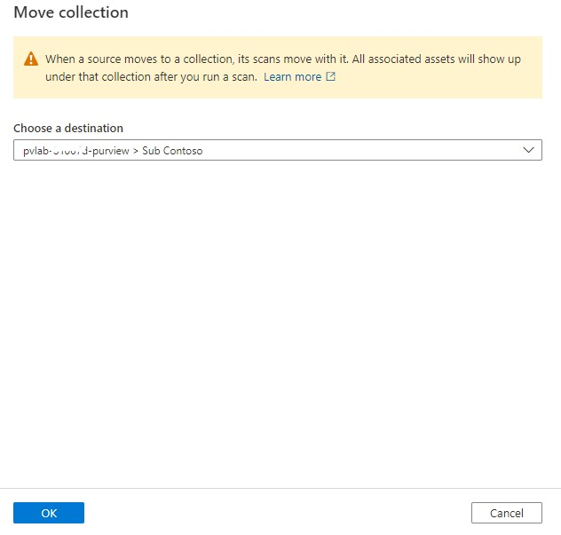

# Registering & Scanning SQL Database

To populate Microsoft Purview with assets for data discovery and understanding, we must register sources so that we can leverage the scanning capabilities. 
Scanning enables Microsoft Purview to extract technical metadata such as the fully qualified name, schema and data types.

In this demo, you'll walk through how to register and scan data sources.

## Objectives:

- By the end of this module you'll have technical metadata, such as schema information, stored in Purview. 
- You can use this to start linking to business terms, allowing your team members to find data more easily which will be demonstrated in the upcoming demos.

## Pre-requisites:

- An *Azure account* with an active *subscription*
- An *Azure SQL Server* and an *Azure SQL Database*
- Users should have *Data Source Admin permission* to register a data source in the Purview Account.

## Registering SQL DB:

1. Go to **Data Map** -> **Sources** -> **Expand** the Root Collection to **Contoso**.

2. Click on the **Register icon** in the Contoso Collection.

   

3. Search for **Azure SQL Database** in the Register sources blade.

   

4. Fill in the data **source name**, select the **Azure subscription** and **sql server name** where the database is located.

   

5. Select a collection: ```pvlab-{randomid}-purview>Contoso``` and click **Register**.

6. The created data source will be put under the selected collection, **Contoso**. Click **View details** to see the data source.

   

## Scanning SQL DB:

1. Before Scanning the data source. Go to the **resource group** in the **azure portal**.

2. Go to the **SQL Server**. Navigate to **Azure Active Directory**. Click **Set Admin**.
   Provide the Purview account **Managed Identity, [pvlab-{randomid}-purview]** and **Save**.

   

   

3. Go to the **SQL Database** in the **Azure Portal**. Click on **Set Firewall**. Under **Firewall Rules** tab,
   **Add Client IPv4 address**, **toggle on** the **Exceptions**, allowing azure resources and services to access the server and **Save**.
   
   

   

4. Now go to **Purview workspace**, Click **New Scan** in the registered SQL DB source.
   
   

5. Provide the **Scan name**, Database name, Credential, select a collection.
   
   
   
6. **Test Connection**, once the scan is **Successful**, click **Continue**.

> If the Scan is failed, then you forgot to add the client ip address to Firewall in Azure SQL database and set admin in sql server.

7. In the **Scope your scan** blade, Select the AzureSQLDatabase and **Continue**.
   
   

8. Select the _System Default_ Scan rule set and **Continue**.

   
   
9. Set the scan trigger as **Once** and **Continue**.
   
   
   
> Now you can either select a recurring scan or one time, in our case we will select “ONCE.” 
> In case you have selected recurring, it will be scanning all assets in that scope based on the schedule you provide. 

10. Review, Save and Run the scan.

    
    
11. You can view the details of the scan in the Source page.

    
    
    

12. Once the scan is successfully completed, view the number of assets in the **Overview** section.

13. The source registered in the *Contoso* collection can also be moved to any other collection by the *Move* option provided in the details page.

    
    
    

[ ⏮️ Previous Module](../02_creating-collection-and-adding-role-assignments/documentation.md) - [Next Module ⏭️](../04_registering-and-scanning-adls-gen2-account/documentation.md)
