# Searching and Editing Assets

Once sources have been registered and scanned, the underlying data catalog will begin to populate with assets that represent real-world objects (e.g. a table in an Azure SQL Database, a Power BI report, etc.) The surfacing of these assets via Microsoft Purview's search experience helps empower data consumers to find data assets that matters to them.

In this module, you'll learn to edit technical metadata by adding definitions and classifications to data attributes, such as tables and columns. You'll learn to assign technical ownership by linking technical attributes to contact persons. You'll learn to use classifications to mark data. All these activities, such as categorizing data, will help you to better manage your data.

## Prerequisites
*	An Azure account with an active subscription.
*	An Azure Purview account (covered in Create an Azure Purview Account Demo) 
*	Relevant data sources are registered and scanned in Azure Purview and underlying data catalog has been populated. 

## Objectives
* Search the catalog by keyword.
* Browse the catalog by source.
* Update an existing asset.
* Perform a bulk edit operation.

## 1. Search Catalog
1. Open the **Microsoft Purview Governance Portal**, navigate to **Data Catalog** > **Home**, type the asterisk character (**\***) into the search bar, and hit **Enter**.

  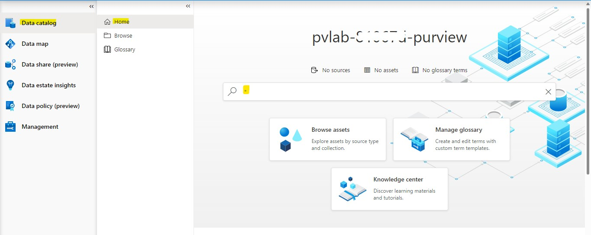
  
2. Filter the search results by **Classification** (e.g. **Country/Region**) and click the hyperlinked asset name to view the details (e.g. `QueriesByState`).

  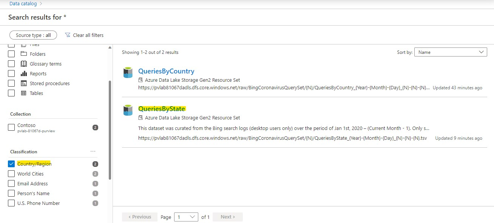
  

## 2. Update an Asset
1. Click **Edit** to modify the asset details.

    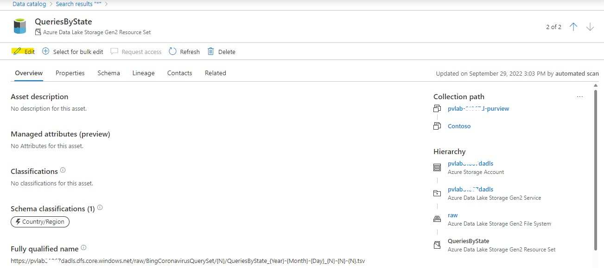
    
2. Update the **Description** by copying and pasting the sample text below.

    ```text
    This dataset was curated from the Bing search logs (desktop users only) over the period of Jan 1st, 2020 – (Current Month - 1). Only searches that were issued many times by multiple users were included. The dataset includes queries from all over the world that had an intent related to the Coronavirus or Covid-19. In some cases this intent is explicit in the query itself (e.g., “Coronavirus updates Seattle”), in other cases it is implicit , e.g. “Shelter in place”
    ```
    
3. Assign a **Classification** (e.g. `World Cities`) using the drop-down menu.

    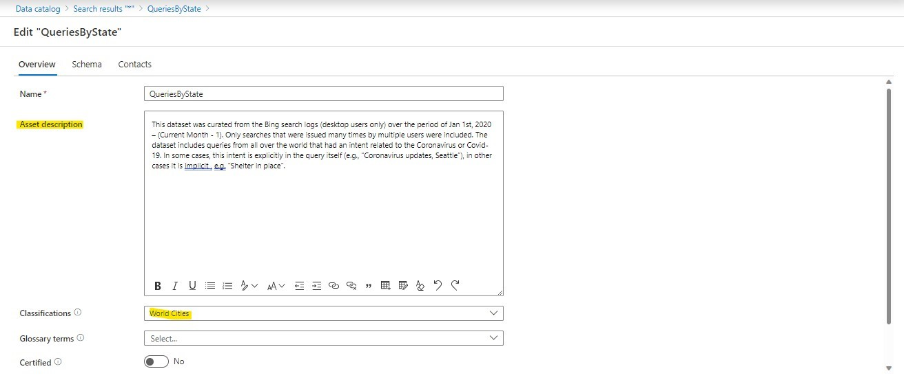
    
4. Navigate to the **Schema** tab and update the **Asset description** for each column using the sample text below.

    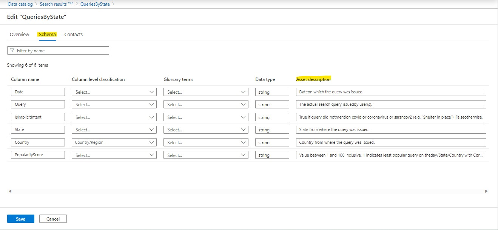
    
    **Date**

    ```text
    Date on which the query was issued.
    ```

    **Query**

    ```text
    The actual search query issued by user(s).
    ```

    **IsImplicitIntent**

    ```text
    True if query did not mention covid or coronavirus or sarsncov2 (e.g, “Shelter in place”). False otherwise.
    ```

    **State**

    ```text
    State from where the query was issued.
    ```

    **Country**
    
    ```text
    Country from where the query was issued.
    ```

    **PopularityScore**

    ```text
    Value between 1 and 100 inclusive. 1 indicates least popular query on the day/State/Country with Coronavirus intent, and 100 indicates the most popular query for the same geography on the same day.
    ```
    
5. Navigate to the **Contacts** tab and set someone within your organization to be an **Expert** and an **Owner**. Click **Save**.
  
    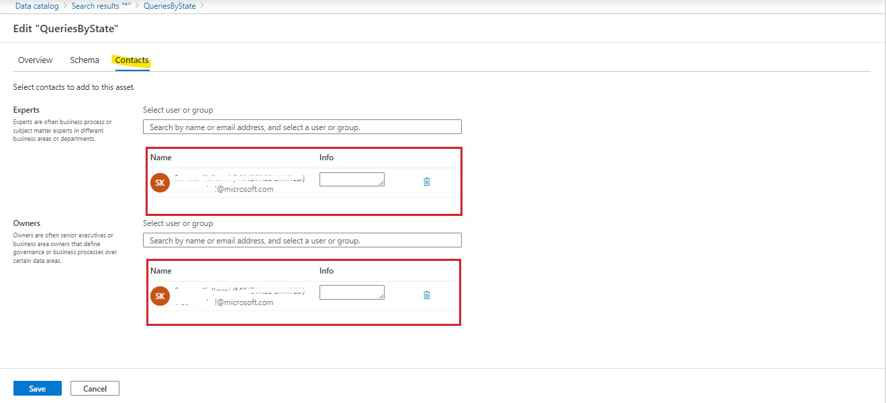
    
6. To see other assets within the same path, navigate to the **Related** tab.

    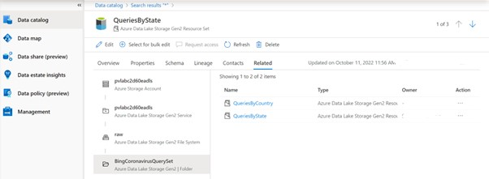
    
 
## 3. Browse Assets

While the search experience is ideal for keyword based discovery, the Microsoft Purview Governance Portal allows alternate methods of browsing assets (i.e. by collection OR by source type).

1. Open the **Microsoft Purview Governance Portal**, click on  **Browse assets** in the homepage.

    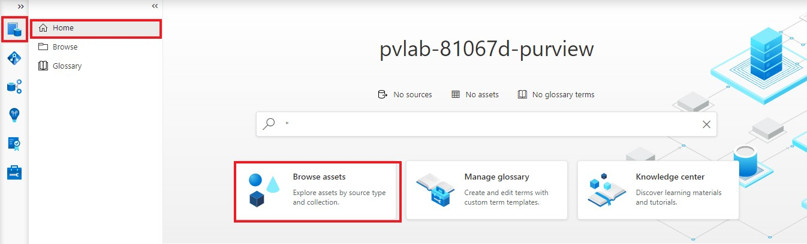
    
2. On the **Browse asset page**, select **By collection pivot**. Collections are listed with hierarchical table view. To further explore assets in each collection, select the corresponding collection name.

    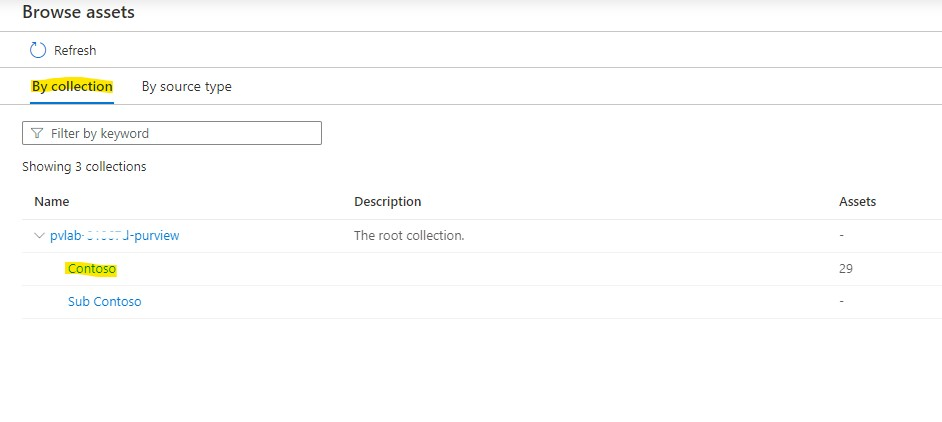

3. On the next page, the search results of the assets under selected collection will show up. You can narrow the results by selecting the filters. Or you can see the assets under other collections by selecting the sub/related collection names.
    
    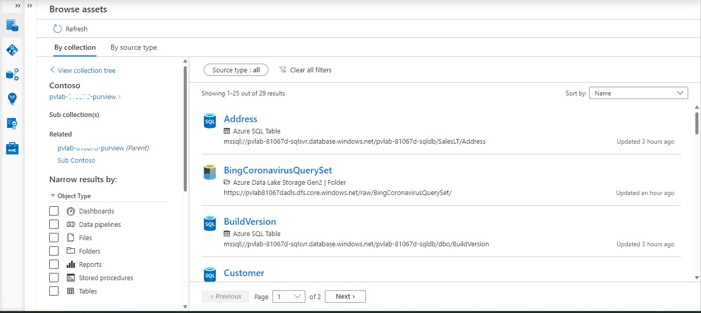
    
4. Switch to the **By source type** tab and select a **source** (e.g. `Azure Data Lake Storage Gen2`).

    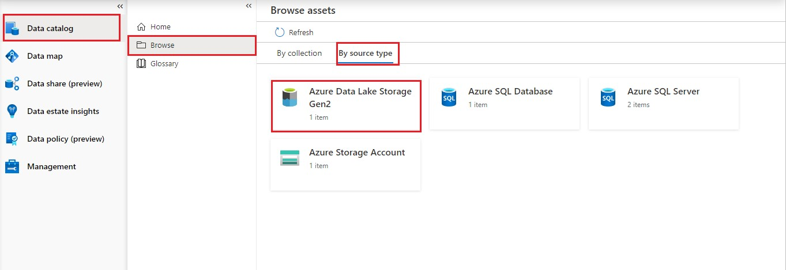
    
5. Select an **account** (e.g. `pvlab{randomId}adls`). 

   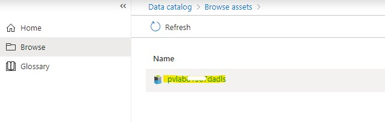 

6. Select a **container** (e.g. `raw`).

    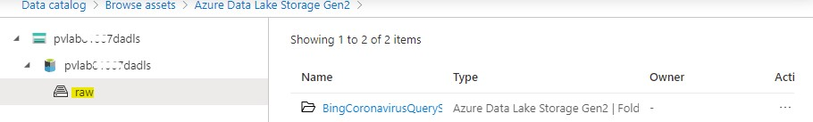
    
## 4. Bulk Edit
Microsoft Purview allows us to perform certain operations (add/replace/remove) against a subset of attributes (Expert, Owner, Term, Classification) in bulk directly within the Microsoft Purview Governance Portal.

1. Open the **Microsoft Purview Governance Portal**, navigate to **Data Catalog** > **Home**, type the asterisk character (**\***) into the search bar, and hit **Enter**.

   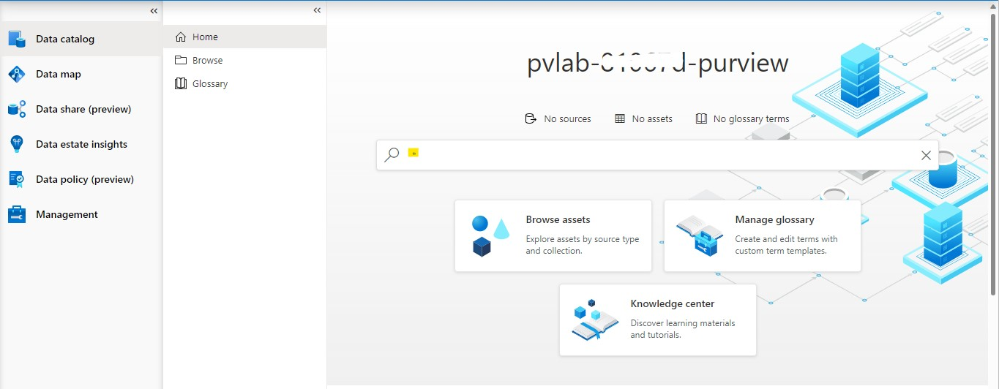 

2. Hover your mouse over an item in the list to reveal the checkbox on the right-hand side. Select five items and click **View selected**.

    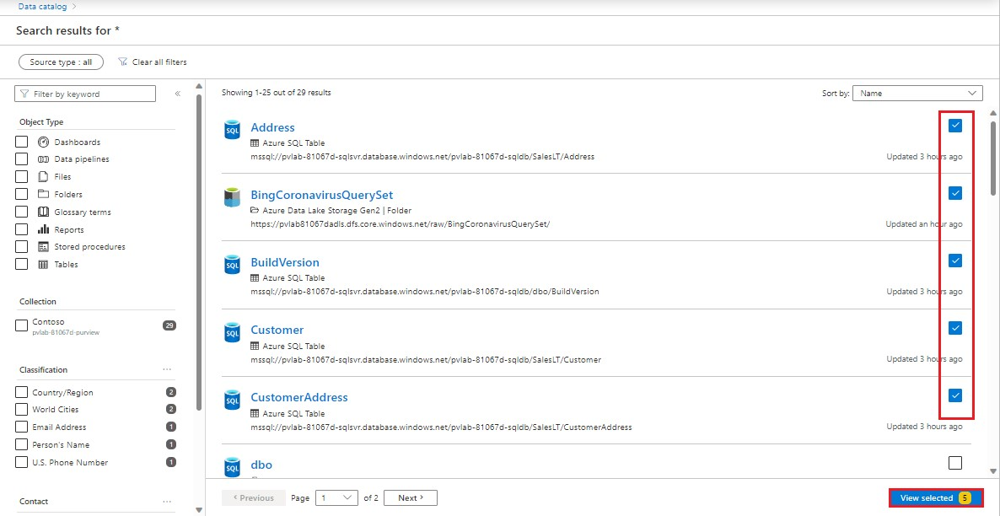

3. Click **Bulk edit**.

    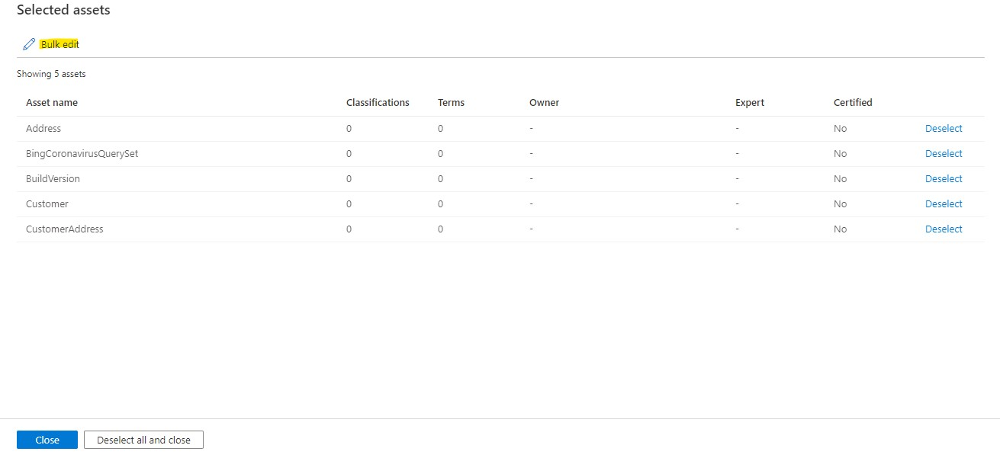

4. Set the **Attribute** to `Owner`, set **Operation** to `Add`, select one or more users in your organization, and click **Apply**.

    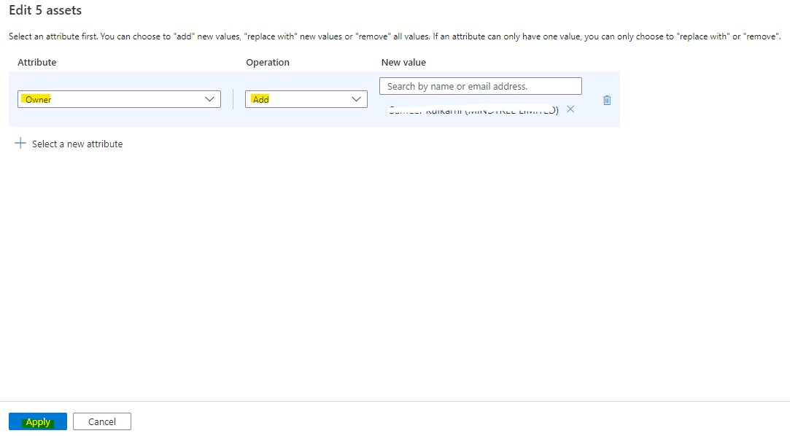

5. Click **Deselect all and close**.

    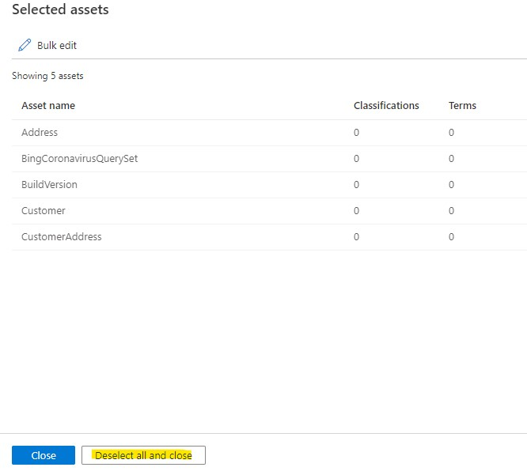


  [ ⏮️ Previous Module](../03_registering-and-scanning-an-on-premises-sql-server-instance/documentation.md) 
